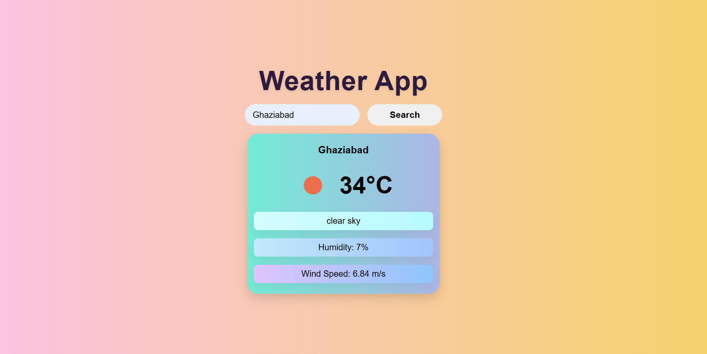

## 🌤 Weather App

A modern and responsive Weather App built using HTML, CSS, and JavaScript that fetches real-time weather data from the OpenWeather API.

## 🚀 Features

🔍 Search weather by city name

🌡 Displays current temperature in °C

🌥 Shows weather condition

💧 Displays humidity percentage

🌬 Displays wind speed

🖼 Dynamic weather icon

⚠ Error handling for invalid city input

🎨 Modern UI with gradients, transitions, and hover effects

## 🛠 Tech Stack

HTML5 – Structure

CSS3 – Styling, Gradients, Transitions, Box Shadows

JavaScript (ES6) – DOM Manipulation & Fetch API

Weather data from OpenWeather

## 🌍 Live Demo

[Click Here to View Live Project](https://niyatipandey.github.io/weather-app-js/)

## 📸 Screenshot



## 📂 Project Structure

weather-app/
```
 ├── index.html
 ├── style.css
 ├── app.js
 ├── weather_app.png
 └── README.md
 ```
## ⚙ How It Works

User enters a city name.

JavaScript sends a request to the OpenWeather API using fetch().

The API returns weather data in JSON format.

The DOM is dynamically updated with:

Temperature

Weather condition

Humidity

Wind speed

Weather icon

If the city is invalid, an error message is displayed.

## 📚 What I Learned

Using Fetch API to retrieve real-time data

Handling JSON responses

Implementing basic error handling

Dynamically updating the DOM

Improving UI with CSS gradients and transitions

Managing focus states and accessibility

## 🔮 Future Improvements

Add loading spinner

Add 5-day weather forecast

Add dynamic background based on weather

Improve responsiveness for small devices
